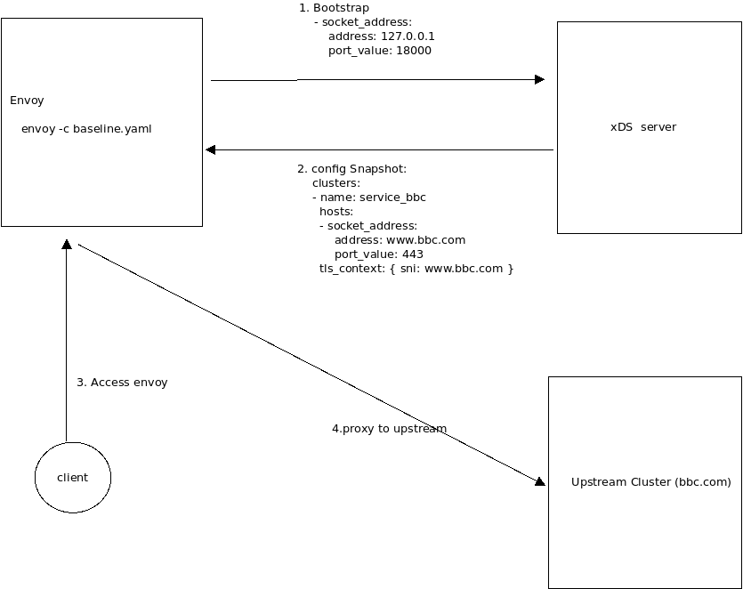
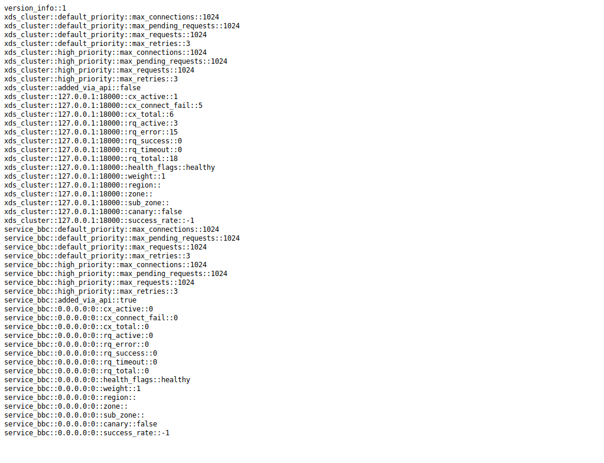

# Envoy control plane "hello world"


A couple of weeks ago  (update:  `11/20/20` _years ago_!) i wanted to program and understand how the control plane for [Envoy Proxy](https://www.envoyproxy.io/) works.
I know its used in various comprehensive control systems like [Istio](https://www.istio.io/) and ofcourse at Lyft.

This repo/article describes a sample golang control plane for an Envoy Proxy.  It demonstrates its dynamic configuration by 
getting a specific pre-detetermined setting set push to each proxy at runtime.  

For reference, the basic equivalent envoy `yaml` file that this xds server emulates is contained in `bbc.yaml`

We will be using 

* [Envoy v3(https://www.envoyproxy.io/docs/envoy/latest/api/api_supported_versions) 
* [Aggregate Discovery Service](https://www.envoyproxy.io/docs/envoy/latest/api-v3/service/discovery/v3/ads.proto)
  ADS will return the Cluster, Listener and Secrets all in one Snapshot

That is, once Envoy is started, it reads in an empty configuration which only tells it where the control plane gRPC server exists.

After connecting to the control plane, it receives configuration information to setup an upstream cluster, listener and secret set.  The 
specific listener and cluster is trivial:  it merely proxies a request for `https://www.bbc.com/robots.txt`, then after a minute, it will update the envoy config to proxy for `www.yahoo.com/robots`  then finally after another minute, `blog.salrashid.me`.

The Secrets are distributed are basically just a TLS certificate for envoy:

`client`-> TLS -> `envoy` -> `upstream` in three ways:

* TLS certs are provided in three ways

1. ADS server will directly return embedded TLS configuration with inline certificates

2. ADS server will return the reference value for the `Secret` to use.  The secret value is a static local reference to the certificates

3. ADS server will return the `Secret` reference as well as the `Secret` itself.


> Note: much of the code and config i got here is taken from the Envoy [integration test suite](https://github.com/envoyproxy/go-control-plane/tree/master/pkg/test/main)


## Additional Reading

- [Matt Klien's blog](https://blog.envoyproxy.io/the-universal-data-plane-api-d15cec7a)
- [Envoy Configuration Guide](https://www.envoyproxy.io/docs/envoy/latest/configuration/overview/v2_overview#)
- [Envoy xDS data plane API](https://github.com/envoyproxy/data-plane-api/blob/master/XDS_PROTOCOL.md)
- [Envoy golang control plane](https://github.com/envoyproxy/go-control-plane)
- [Envoy java control plane](https://github.com/envoyproxy/java-control-plane)
- [Control Plane Sample](https://github.com/uswitch/yggdrasil/blob/master/pkg/envoy/boilerplate.go)



---

## Setup


### Start Control Plane

do just this:

```bash
$ go run src/main.go 

INFO[0000] Starting control plane                       
INFO[0000] management server listening                   port=18000
```

The code is almost entirely contained in [src/main.go](src/main.go) which launches the control plane and proceeds to setup a static config to proxy to a set of `/robots.txt` files from three sites:

```golang
[]string{"www.bbc.com", "www.yahoo.com", "blog.salrashid.me"}
```

Every 60 seconds, the host will rotate over which means for the first 60 seconds, you'll see the robots.txt file from bbc, then yahoo then google.

Note, we increment the snapshot version number and the host as well after envoy node connects:

```log
$ go run  src/main.go 

INFO[0000] Starting control plane                       
INFO[0000] management server listening                   port=18000
INFO[0001] OnStreamOpen 1 open for                      
INFO[0001] OnStreamRequest type.googleapis.com/envoy.config.cluster.v3.Cluster 
INFO[0001] >>>>>>>>>>>>>>>>>>> creating cluster, remoteHost, nodeID service_bbc,  www.bbc.com, test-id 
INFO[0001] >>>>>>>>>>>>>>>>>>> creating listener listener_0 
INFO[0001] >>>>>>>>>>>>>>>>>>> creating Secret server_cert 
INFO[0001] >>>>>>>>>>>>>>>>>>> creating snapshot Version 1 
INFO[0001] OnStreamResponse...                          
INFO[0001] cb.Report()  callbacks                        fetches=0 requests=1
INFO[0001] OnStreamRequest type.googleapis.com/envoy.config.cluster.v3.Cluster 
INFO[0001] OnStreamRequest type.googleapis.com/envoy.config.listener.v3.Listener 
INFO[0001] OnStreamResponse...                          
INFO[0001] cb.Report()  callbacks                        fetches=0 requests=3
INFO[0001] OnStreamRequest type.googleapis.com/envoy.config.listener.v3.Listener 
INFO[0061] >>>>>>>>>>>>>>>>>>> creating cluster, remoteHost, nodeID service_bbc,  www.yahoo.com, test-id 
INFO[0061] >>>>>>>>>>>>>>>>>>> creating listener listener_0 
INFO[0061] >>>>>>>>>>>>>>>>>>> creating Secret server_cert 
INFO[0061] >>>>>>>>>>>>>>>>>>> creating snapshot Version 2 
INFO[0061] OnStreamResponse...                          
INFO[0061] cb.Report()  callbacks                        fetches=0 requests=4
```

You can review the code to see how the structure is nested and initialized.

If you just set the value to bbc and not iterate, the code will behave as if [bbc.yaml](bbc.yaml) config file was passed to envoy:

### Run Envoy

To run envoy, just download a local envoy

>> *NOTE* we are using `envoy 1.17`

``` 
   docker cp `docker create envoyproxy/envoy-dev:latest`:/usr/local/bin/envoy .

   ./envoy --version
   envoy  version: 483dd3007f15e47deed0a29d945ff776abb37815/1.17.0-dev/Clean/RELEASE/BoringSSL
```

Then invoke

```
./envoy -c baseline.yaml -l debug
```

### Access proxy

```bash
curl  -H "Host: http.domain.com" \
   --resolve  http.domain.com:10000:127.0.0.1 \
   --cacert certs/tls-ca.crt https://http.domain.com:10000/
```

---


#### Create Cluster

```golang
		var clusterName = "service_bbc"
		var remoteHost = v

		log.Infof(">>>>>>>>>>>>>>>>>>> creating cluster, remoteHost, nodeID %s,  %s, %s", clusterName, v, nodeId)

		hst := &core.Address{Address: &core.Address_SocketAddress{
			SocketAddress: &core.SocketAddress{
				Address:  remoteHost,
				Protocol: core.SocketAddress_TCP,
				PortSpecifier: &core.SocketAddress_PortValue{
					PortValue: uint32(443),
				},
			},
		}}
		uctx := &envoy_api_v2_auth.UpstreamTlsContext{}
		tctx, err := ptypes.MarshalAny(uctx)
		if err != nil {
			log.Fatal(err)
		}

		c := []types.Resource{
			&cluster.Cluster{
				Name:                 clusterName,
				ConnectTimeout:       ptypes.DurationProto(2 * time.Second),
				ClusterDiscoveryType: &cluster.Cluster_Type{Type: cluster.Cluster_LOGICAL_DNS},
				DnsLookupFamily:      cluster.Cluster_V4_ONLY,
				LbPolicy:             cluster.Cluster_ROUND_ROBIN,
				LoadAssignment: &endpoint.ClusterLoadAssignment{
					ClusterName: clusterName,
					Endpoints: []*endpoint.LocalityLbEndpoints{{
						LbEndpoints: []*endpoint.LbEndpoint{
							{
								HostIdentifier: &endpoint.LbEndpoint_Endpoint{
									Endpoint: &endpoint.Endpoint{
										Address: hst,
									}},
							},
						},
					}},
				},
				TransportSocket: &core.TransportSocket{
					Name: "envoy.transport_sockets.tls",
					ConfigType: &core.TransportSocket_TypedConfig{
						TypedConfig: tctx,
					},
				},
			},
		}
```

#### Create Listener

Create a basic listener on port `10000`

```golang
		var listenerName = "listener_0"
		var targetHost = v
		var targetPrefix = "/"
		var virtualHostName = "local_service"
		var routeConfigName = "local_route"

		log.Infof(">>>>>>>>>>>>>>>>>>> creating listener " + listenerName)

		rte := &route.RouteConfiguration{
			Name: routeConfigName,
			VirtualHosts: []*route.VirtualHost{{
				Name:    virtualHostName,
				Domains: []string{"*"},
				Routes: []*route.Route{{
					Match: &route.RouteMatch{
						PathSpecifier: &route.RouteMatch_Prefix{
							Prefix: targetPrefix,
						},
					},
					Action: &route.Route_Route{
						Route: &route.RouteAction{
							ClusterSpecifier: &route.RouteAction_Cluster{
								Cluster: clusterName,
							},
							PrefixRewrite: "/robots.txt",
							HostRewriteSpecifier: &route.RouteAction_HostRewriteLiteral{
								HostRewriteLiteral: targetHost,
							},
						},
					},
				}},
			}},
		}

		manager := &hcm.HttpConnectionManager{
			CodecType:  hcm.HttpConnectionManager_AUTO,
			StatPrefix: "ingress_http",
			RouteSpecifier: &hcm.HttpConnectionManager_RouteConfig{
				RouteConfig: rte,
			},
			HttpFilters: []*hcm.HttpFilter{{
				Name: wellknown.Router,
			}},
		}
```


#### 1. TLS Static 

In the first TLS option, we will create a static TLS certs to beam down:

```golang
		priv, err := ioutil.ReadFile("certs/server.key")
		if err != nil {
			log.Fatal(err)
		}
		pub, err := ioutil.ReadFile("certs/server.crt")
		if err != nil {
			log.Fatal(err)
		}

		sdsTls := &envoy_api_v3_auth.DownstreamTlsContext{
			CommonTlsContext: &envoy_api_v3_auth.CommonTlsContext{
				TlsCertificates: []*envoy_api_v3_auth.TlsCertificate{{
					CertificateChain: &core.DataSource{
						Specifier: &core.DataSource_InlineBytes{InlineBytes: []byte(pub)},
					},
					PrivateKey: &core.DataSource{
						Specifier: &core.DataSource_InlineBytes{InlineBytes: []byte(priv)},
					},
				}},
			},
		}

		...
		...


		scfg, err := ptypes.MarshalAny(sdsTls)
		if err != nil {
			log.Fatal(err)
		}

		var l = []types.Resource{
			&listener.Listener{
				Name: listenerName,
				Address: &core.Address{
					Address: &core.Address_SocketAddress{
						SocketAddress: &core.SocketAddress{
							Protocol: core.SocketAddress_TCP,
							Address:  localhost,
							PortSpecifier: &core.SocketAddress_PortValue{
								PortValue: 10000,
							},
						},
					},
				},
				FilterChains: []*listener.FilterChain{{
					Filters: []*listener.Filter{{
						Name: wellknown.HTTPConnectionManager,
						ConfigType: &listener.Filter_TypedConfig{
							TypedConfig: pbst,
						},
					}},
					TransportSocket: &core.TransportSocket{
						Name: "envoy.transport_sockets.tls",
						ConfigType: &core.TransportSocket_TypedConfig{
							TypedConfig: scfg,
						},
					},
				}},
			}}

```

#### 2. SDS Static 

In the second option, you need to enable the SDS Static reference

Edit `baseline.yaml`, and uncomment

```yaml

  secrets:
  - name: server_cert
    tls_certificate:
      certificate_chain:
        filename: certs/server.crt
      private_key:
        filename: certs/server.key
```

then in `main.go`, 

```golang
		sdsTls := &envoy_api_v3_auth.DownstreamTlsContext{
			CommonTlsContext: &envoy_api_v2_auth.CommonTlsContext{
				TlsCertificateSdsSecretConfigs: []*envoy_api_v2_auth.SdsSecretConfig{{
					Name: "server_cert",
				}},
			},
		}
```

What the above setting will do is instruct envoy to look for a local static secret (you know,the one we just uncommented)


#### 3. SDS Dynamic

The following Secrets config will provide a reference *and* beam down the Secret itself

```golang
		sdsTls := &envoy_api_v3_auth.DownstreamTlsContext{
			CommonTlsContext: &envoy_api_v3_auth.CommonTlsContext{
				TlsCertificateSdsSecretConfigs: []*envoy_api_v3_auth.SdsSecretConfig{{
					Name: "server_cert",
					SdsConfig: &core.ConfigSource{
						ConfigSourceSpecifier: &core.ConfigSource_Ads{
							Ads: &core.AggregatedConfigSource{},
						},
						ResourceApiVersion: core.ApiVersion_V3,
					},
				}},
			},
		}
```

#### Commit Snapshot

Final step is to commit a snapshot of the full config including the cluster, listener and secret
```golang
		snap := cachev3.NewSnapshot(fmt.Sprint(version), nil, c, nil, l, nil, s)
		config.SetSnapshot(nodeId, snap)
```


You can verify the cluster was dynamically added in by viewing the envoy admin console at ```http://localhost:9000```.  A sample output of that console:




### Running static configuration

If you would rather just run the static configuration (i.,e no ADS server), just run


```bash
./envoy -c bbc.yaml
```

---

## Conclusion

I wrote this primarily just to understand how envoy works..As this is the first time i've configured and worked through the structures within Envoy,
its very likely i've missed some construct or concept.  If you see anything amiss, please drop me a line and I'll correct it.